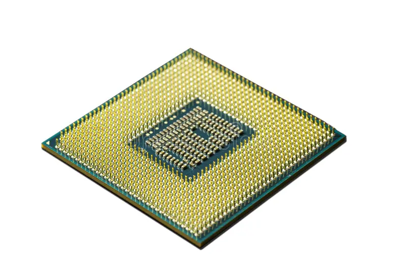
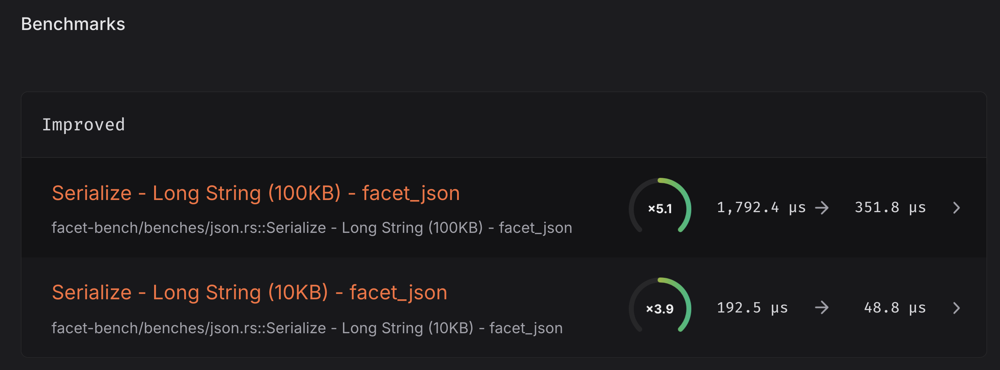

# Your computer is wide

The last couple of days I've been working on improving the performance of facet(-json). In case you've missed it [facet](https://github.com/facet-rs/facet) is a Rust library for doing reflection. The thing with reflection is that it is not really something anyone wants, but rather, people want the things that can be built on top of reflection. To this end, we provide a couple of libraries built on top of facet, one of which is facet-json. As the name sort of gives away, it does JSON serialization and deserialization, but instead of being built on top of codegen, it is built on type information that facet extracts for us. Of course, the rust serialization / deserialization space is extremely well consolidated around serde. The promise of facet is not performance, but we still don't want to be extremely slow compared to serde. At the dawn of this story, we are sitting comfortably at 3-6x slower than serde. For my personal production needs, that is fine. Most web CRUD applications do not spend a significant amount of time parsing the incoming JSON, so a 6x slowdown in parsing is not something you'd even be able to measure. HOWEVER, for fun and profit, we can still try to do better! Let's start with serialization, for no particular reason.

## The attack on `write_json_string`
There is a certain elegance to naive code. At the end of this paragraph, you might come back to the initial snippet and tell me which one reads better. There has to be good payoff to go and mangle beautiful, elegant code to the extent that we're about to. Anyway, with that out of the way, let's focus our attention on `write_json_string`. This is an integral function to JSON serialization, because every single object key in JSON is a string, and my (unfounded, probably wrong) intuition tells me that lots of values will be strings as well: UUIDs, dates, strings, enums, and maybe more things? Anyway, lots of strings, let's make sure we can write them quickly! Here is the function in question:

```rust
fn write_json_string<W: Write>(writer: &mut W, s: &str) -> io::Result<()> {
    writer.write_all(b"\"")?;
    for c in s.chars() {
        write_json_escaped_char(writer, c)?;
    }
    writer.write_all(b"\"")
}
```

It's very simple! We whack `"` into the writer, we loop over the chars, and then we write `"` into the writer again. Let's have a look at `write_json_escaped_char` next, it is doing most of the heavy lifting after all.

```rust
fn write_json_escaped_char<W: Write>(writer: &mut W, c: char) -> io::Result<()> {
    match c {
        '"' => writer.write_all(b"\\\""),
        '\\' => writer.write_all(b"\\\\"),
        '\n' => writer.write_all(b"\\n"),
        '\r' => writer.write_all(b"\\r"),
        '\t' => writer.write_all(b"\\t"),
        '\u{08}' => writer.write_all(b"\\b"),
        '\u{0C}' => writer.write_all(b"\\f"),
        c if c.is_control() => {
            let mut buf = [0; 6];
            let s = format!("{:04x}", c as u32);
            buf[0] = b'\\';
            buf[1] = b'u';
            buf[2] = s.as_bytes()[0];
            buf[3] = s.as_bytes()[1];
            buf[4] = s.as_bytes()[2];
            buf[5] = s.as_bytes()[3];
            writer.write_all(&buf)
        }
        c => {
            let mut buf = [0; 4];
            let len = c.encode_utf8(&mut buf).len();
            writer.write_all(&buf[..len])
        }
    }
}
```

Here we go, slightly more complicated but still fairly legible! We have to escape some characters, but that's fine! We check for ", \\, newline, return, tab, some weird \u stuff that I don't understand, and then we check for control characters, and if none of that is true we UTF-8 encode the character and write it to the writer. My first intuition here is that in the easy match arm here, the bottom one, we are still going through an `encode_utf8` function. What if a character is just ASCII? That means no encoding is needed at all! We could just take `c as u8` and smack that into the writer as-is. Let's make the change:

```rust
fn write_json_escaped_char<W: Write>(writer: &mut W, c: char) -> io::Result<()> {
    match c {
        '"' => writer.write_all(b"\\\""),
        // ...
        c if c.is_control() => {
            // ...
        }
        c if c.is_ascii() => {
            writer.write(&[c as u8])?;
            Ok(())
        }
        c => {
            // ...
        }
    }
}
```

Now let's hop on over to CI to have a look at the sweet sweet performance wins we so desperately crave. The relevant benchmark we are going to be studying to zoom in on the performance of `write_json_string` is called "Serialize - Long String (100KB) - facet_json", which does exactly what it says on the tin: throw a massive string at `facet_json::to_string`.


Whey! 39% improvement, our trick has worked! Apparently not needing to go through complicated encoding functions when we don't need to is something that helps performance! Now for further improvements, let's have a look at the flamegraph of our new and improved function:


Aha! There is a lookup function still taking up a hefty chunk of our speed, and `cc::lookup`? That sounds like control character lookup, might it be the `is_control` function ruining our day? For a solution, let's go back to the thing we learned when we were still young upstart rustlings, and think about how match arms are executed. For each arm from top to bottom the guards are evaluated, meaning that our nemesis, the all expensive `is_control` is always executed before cheap, neighbourhood `is_ascii` (implementation: `*self as u32 <= 0x7F`). Could it really be so simple then? Could it actually be.....

```rust
fn write_json_escaped_char<W: Write>(writer: &mut W, c: char) -> io::Result<()> {
    match c {
        '"' => writer.write_all(b"\\\""),
        // ...
        c if c.is_ascii() => {
            writer.write(&[c as u8])?;
            Ok(())
        }
        c if c.is_control() => {
            // ...
        }
        c => {
            // ...
        }
    }
}
```

There we go, I've written more complicated code in my day! Not a lot more complicated but I've bravely ventured beyond reordering match arms. Let's see if we get a good result for our daring refactor:


This is good! Including with me sprinkling some #[inline] on these two functions, we are at a nice even +94%, 3.2 ms have changed into 1.6 ms. What will we do with all these extra milliseconds we now have! Oh I know! We can spend that time making these functions even faster! The code is still completely legible, and that just simply will not do.

### Let's remember our processors
The device you're currently reading this on is likely a computer, which probably contains a processor. It might even be this one!



Look at all those pins! I bet lots of data can go into the CPU at once. Maybe we can even feed, say, 64 bits into it at once! Hmm but comparing that to our code, we're not really doing that. We're processing one 32-bit `char` at a time, and most chars will probably be ASCII, so most of the time our `char` being processed results in only 8 bits being written. All of the chip design in the last 50 years did not happen for us to then just only use the original 8 bits of the processor.

We are going to take the string as it comes in, split it into chunks of 64 bits, and write them all at once if we can. Let's start with the splitting part, where we go over the incoming `&[u8]` in windows of 8, and then we construct a single u64 out of those 8.

```rust
fn write_json_string<W: Write>(writer: &mut W, s: &str) -> io::Result<()> {
    const STEP_SIZE: usize = Window::BITS as usize / 8;
    type Window = u64;
    type Chunk = [u8; STEP_SIZE];

    while let Some(Ok(chunk)) = s.as_bytes().get(..STEP_SIZE).map(Chunk::try_from) {
        let window = Window::from_ne_bytes(chunk);
```

We now have a `u64` representing 8 bytes at once! Whey! Next up we need to make sure that we can actually validly write all these bytes into the writer as they are. Remember all those match arms in `write_json_escaped_char`? Well if we hit the "easy" one that just did `writer.write(&[c as u8])` we should be good right? If all of our bytes are simple ASCII we could simply change this into `writer.write(&chunk)` and write 64 bits in one go. The hard part for this is, can we figure out for all these 8 u8's at once:
1. Whether they are ASCII or not,
2. they are not control characters,
3. it doesn't contain `"`, `\`, newline, return, tab because that means we need to insert an extra `\` as a friend for it.

To the ASCII table!


Oh look! newline, return and tab are all control characters! That'll save some trouble later.

Okay step 1, check for the ASCII-hood of our character. According to this table, the greatest possible valid ASCII value is 127, or as they call it in computer land, `0b01111111`. Wow that is convenient! That means that if the leftmost bit is set, it must not be ASCII! Translated into pristine code we get `let is_ascii = val & 0b10000000 != 0;`.

Step 2, control characters: what we can see is that the control characters are all in the left column, their greatest number is 31. To the computer that means any values lower than or equal to `0b00011111`. This means that we can do `let is_control = val & 0b11100000 == 0;`.

And finally step 3, we only need to check for `"` and `\`  because the other ones were control characters! These are much simpler, because we are checking for one specific bit pattern each time, we can just read their values from the ASCII table: `let is_quote = val & 0x22;` and `let is_backslash = val & 0x5c;`.

That is everything we need to check! But there is a snag, we've just written code snippets that can check whether an individual `u8` has the properties we are looking for, but what we need is a function that can check whether any of the 8 `u8`s that make up a `u64` contain these properties, and ideally in a few bitwise operations so it goes fast. Fortunately this can be done, let's dive into the details for the backslash case, since it has a nice and recognizable bit pattern. First we xor our val with a mask that has the pattern we're looking for for each u8, i.e. `0x5c5c5c5c5c5c5c5c`. This means that we will get `00` only in those places where the `5c` originally occurred in our u64. We can then detect these `00`s by subtracting `01` from each `u8`, that is, subtracting `0x0101010101010101` from the whole number. This causes an underflow / carry if the value was set to `00` causing the new value to be `ff`, and for any bit pattern other than `00`, it does not cause this underflow. We then `&` this together with the bitwise negation of our initial xor. Remember that this value had `00` only where there was `5c` to begin with, so all values that were `5c` will be `ff` in the negation. This means that for values that underflowed, we are now doing `FF & FF` resulting in another `FF`. All values that did not underflow are getting `(val - 1) & !val`, which at its greatest can be `7F`. This means that the top bit is never set, so at that point we can simply do `result & 0x80` and check if any number is still set to detect the occurrence of `5c` in our u64. The steps are demonstrated below for 3 `u16` values (not `u64` because that would be horrible to read), `0x5c12`, `0x1234` and for `0x15c3`. The last one is sneaky because it does have `5c` in it, but not in the way we are interested in! Remember, we are interpreting this number as tuples of `u8`s, so `(15, c3)` does not count!

```
0x5c12          0x1234          0x15c3
0x5c5c          0x5c5c          0x5c5c
------ ^        ------ ^        ------ ^
0x004e          0x4e68          0x499f => xor_result
0x0101          0x0101          0x0101
------ -        ------ -        ------ -
0xff4d          0x4d67          0x489e
0xffb1          0xb197          0xb660 <= !xor_result
------ &        ------ &        ------ &
0xff01          0x0107          0x0000
0x8080          0x8080          0x8080
------ &        ------ &        ------ &
0x8000          0x0000          0x0000
```

Here we have the function written in Rust rather than English.

```rust
fn contains_0x5c(val: u64) -> bool {
    let xor_result = val ^ 0x5c5c5c5c5c5c5c5c;
    let has_zero = (xor_result.wrapping_sub(0x0101010101010101))
        & !xor_result
        & 0x8080808080808080;
    has_zero != 0
}
```

Now so far we've talked about using `u64`s, because that is what our computers use, but we can go one step beyond `u64`s and use `u128`. At that point we are no longer leveraging the hugeness of our processor, but we are using the fact that LLVM is full of really smart people that run circles around whatever code I can conjure up. The modification is extremely simple:

```rust
#[inline]
fn contains_0x5c(val: u128) -> bool {
    let xor_result = val ^ 0x5c5c5c5c5c5c5c5c5c5c5c5c5c5c5c5c;
    let has_zero = (xor_result.wrapping_sub(0x01010101010101010101010101010101))
        & !xor_result
        & 0x80808080808080808080808080808080;
    has_zero != 0
}
```

Now, there are bitwise comparisons left to do for the other two checks we perform:

```rust
#[inline]
fn contains_0x22(val: u128) -> bool {
    let xor_result = val ^ 0x22222222222222222222222222222222;
    let has_zero = (xor_result.wrapping_sub(0x01010101010101010101010101010101))
        & !xor_result
        & 0x80808080808080808080808080808080;
    has_zero != 0
}

#[inline]
fn top_three_bits_set(value: u128) -> bool {
    let xor_result = value & 0xe0e0e0e0e0e0e0e0e0e0e0e0e0e0e0e0;
    let has_zero = (xor_result.wrapping_sub(0x01010101010101010101010101010101))
        & !xor_result
        & 0x80808080808080808080808080808080;
    has_zero == 0
}
```

There we go! This sets us up nicely to continue our `write_json_string` function where we left off what I can only describe as so long ago.

```rust
fn write_json_string<W: Write>(writer: &mut W, s: &str) -> io::Result<()> {
    const STEP_SIZE: usize = Window::BITS as usize / 8;
    type Window = u128;
    type Chunk = [u8; STEP_SIZE];

    while let Some(Ok(chunk)) = s.as_bytes().get(..STEP_SIZE).map(Chunk::try_from) {
        let window = Window::from_ne_bytes(chunk);
        // New bit starts from here:
        let completely_ascii = window & 0x80808080808080808080808080808080 == 0;
        let quote_free = !contains_0x22(window);
        let backslash_free = !contains_0x5c(window);
        let control_char_free = top_three_bits_set(window);
        if completely_ascii && quote_free && backslash_free && control_char_free {
            // Yay! Whack it into the writer!
            writer.write_all(&chunk)?;
            s = &s[STEP_SIZE..];
        } else {
            // Ahw one of the conditions not met. Let's take our time and artisanally handle each
            // character.
            let mut chars = s.chars();
            let mut count = STEP_SIZE;
            for c in &mut chars {
                write_json_escaped_char(writer, c)?;
                count = count.saturating_sub(c.len_utf8());
                if count == 0 {
                    // Done with our chunk
                    break;
                }
            }
            s = chars.as_str();
        }
    }
    // todo
}
```
_credit to Veykril for helping tidy this code up._

Let's break down the new bit. We start out by applying the beautiful functions we just wrote and a check for ASCII-ness, and then, if all those conditions are met, we write the whole chunk into the writer. Finally, we point `s` to whatever is at the end of our chunk and the iteration is done. This is the fast case where we really want to be. However, sometimes one or more of our conditions for the fast case might not be met. In that case the eagle-eyed viewer will detect that we just apply the old, slower method to properly handle all the escapes. There is however a problem. The number of bytes in the string might not be neatly divisible by `STEP_SIZE`, and even if it were, the width of the encoded characters can be anywhere between 1 `u8` and 4 `u8`s when we hit our slower path, so we have no idea how we are going to end up at the end. Fortunately all modern keyboards come with the magical solution of just copy pasting the `write_json_escaped_char`-loop a second time below our outer loop, and making sure that we handle any remnant at the end:

```rust
#[inline]
fn write_json_string<W: Write>(writer: &mut W, s: &str) -> io::Result<()> {
    const STEP_SIZE: usize = Window::BITS as usize / 8;
    type Window = u128;
    type Chunk = [u8; STEP_SIZE];

    writer.write_all(b"\"")?;

    let mut s = s;
    while let Some(Ok(chunk)) = s.as_bytes().get(..STEP_SIZE).map(Chunk::try_from) {
        let window = Window::from_ne_bytes(chunk);
        let completely_ascii = window & 0x80808080808080808080808080808080 == 0;
        let quote_free = !contains_0x22(window);
        let backslash_free = !contains_0x5c(window);
        let control_char_free = top_three_bits_set(window);
        if completely_ascii && quote_free && backslash_free && control_char_free {
            // Yay! Whack it into the writer!
            writer.write_all(&chunk)?;
            s = &s[STEP_SIZE..];
        } else {
            // Aww one of the conditions not met. Let's take our time and artisanally handle each
            // character.
            let mut chars = s.chars();
            let mut count = STEP_SIZE;
            for c in &mut chars {
                write_json_escaped_char(writer, c)?;
                count = count.saturating_sub(c.len_utf8());
                if count == 0 {
                    // Done with our chunk
                    break;
                }
            }
            s = chars.as_str();
        }
    }

    // new bit starts here
    for c in s.chars() {
        write_json_escaped_char(writer, c)?;
    }

    writer.write_all(b"\"")
}
```

And there is our function! It is all done and correct insofar as I haven't noticed anything wrong with it, which is really the strongest possible guarantee if you think about it, isn't it. Let's see what sort of difference it makes to perf!



Huzzah! A fivefold increase in performance, which should be taken to mean a fivefold increase in reduction of the runtime of the benchmark. The duration has decreased from 3.2 ms at the start of this blog to 351.8 µs now. Out of curiosity, let's see how we compare to `serde`, the incumbent.


It seems we have outdone `serde`! On this particular benchmark. Which is, admittedly, a bit contrived. Looking at all the other benchmarks (which are more realistic) it is clear that `facet-json` has a long way to go until it can actually come close to `serde-json` in terms of performance, but the fact that it is even possible pleasantly surprised me. Of course, thinking about it a bit more, this really makes a lot of sense because in this test we are reading from a buffer, applying a transformation, and then writing to a new buffer. There is not a lot of facet- or serde-specific stuff going on here.
